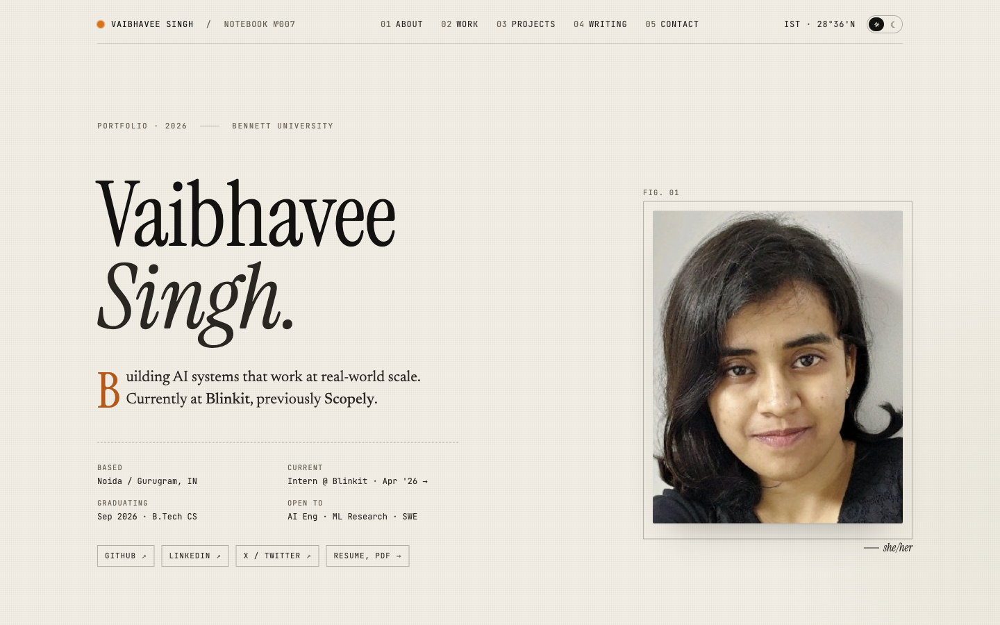

# Vaibhavee Singh — Portfolio

Personal portfolio site for Vaibhavee Singh (AI Engineering, ML Research, SWE),
built as a notebook/magazine-styled single page.

**Live:** https://vaibhavee.appwrite.network/



## Stack

- [TanStack Start](https://tanstack.com/start) (React 19, Vite 8, Nitro)
- TypeScript
- Hand-written CSS (no UI framework)
- Deployed as a static site on [Appwrite Sites](https://appwrite.io/sites)

## Sections

- **Masthead** — name, role, lede, meta, quick links, portrait
- **About** — narrative copy, side metadata, signature
- **Work** — collapsible timeline of roles (Blinkit, Scopely, CDAC, CIMFR, IEEE WiE)
- **Projects** — filterable grid; flagship card features the NETRA confusion-matrix art
- **Writing** — peer-reviewed papers and book chapters
- **Toolbelt** — stack breakdown
- **Quote** — testimonial
- **Contact** — email, social links, footer

A floating tweaks panel (theme · accent · headline · density) ships with the site
for live restyling.

## Develop

```sh
bun install
bun run dev
```

App boots on http://localhost:3000.

## Build

```sh
bun run build
```

Outputs the static client bundle to `dist/client`. The `tsc --noEmit` pass runs
after Vite build to catch type regressions.

## Deploy

Deployment is handled by Appwrite Sites. Configuration lives in
[`appwrite.config.json`](./appwrite.config.json):

- Framework: `tanstack-start`
- Adapter: `static`
- Build: `npm run build`
- Output: `./dist/client`

## Project layout

```
src/
  components/    # Section components (Masthead, Work, Projects, …)
  routes/        # TanStack Router file-based routes
  styles.css     # All site styles (single sheet, layered breakpoints)
  router.ts
public/
  assets/        # Portrait, company logos
docs/
  screenshot.png # README hero shot
```

## License

Personal site — all rights reserved.
